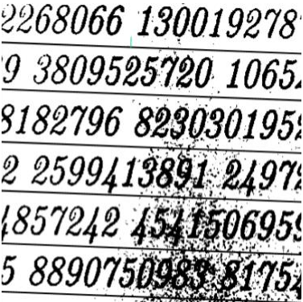
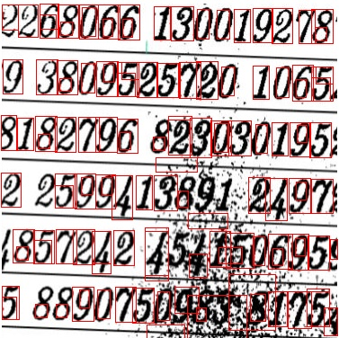

# Number-Bounding-Boxes-Detection
Using python, openCV detect number bounding boxes from noise image 
To build this project, run terminal, cd path command and type 'python 51702187.py' normally.
All about my project containing in file HoangKienThiet_51702187_report.docx](https://github.com/smoothkt4951/Number-Bounding-Boxes-Detection/blob/main/HoangKienThiet_51702187_midterm/HoangKienThiet_51702187_report.docx)

##### Input:

##### Output:

